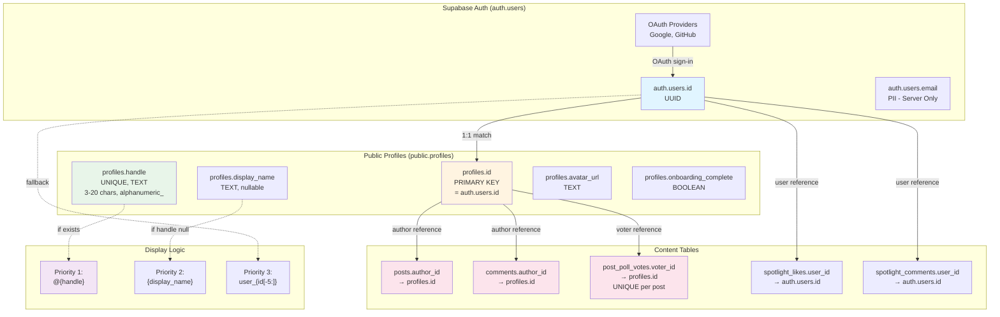

# Username and Authorship Audit

## Summary

The VirtuoHub application uses a **dual-table authorship model** with `public.profiles` as the canonical source of truth for user identity. The system combines Supabase Auth (`auth.users`) for authentication with `public.profiles` for public identity. The single source of truth for a user's public name is **`profiles.handle`**, a unique, case-insensitive username set during onboarding. A secondary optional field **`profiles.display_name`** can override the display in some contexts. Content authorship is tracked via `author_id` columns referencing `profiles.id` (which matches `auth.users.id`). The system supports OAuth-based authentication with automatic profile creation, but **username editing is not currently implemented**, leaving existing content with stale author references.

## Canonical storage

### Table and Column
- **Primary Table**: `public.profiles`
- **Primary Column**: `handle` (TEXT, UNIQUE, nullable)
- **Secondary Column**: `display_name` (TEXT, nullable)
- **ID Column**: `id` (VARCHAR, PRIMARY KEY) - matches `auth.users.id`

### Creation Flow
1. **Authentication**: User signs in via Supabase Auth (OAuth providers like Google, GitHub)
2. **Profile Upsert**: `AuthProvider.tsx` calls `POST /api/profile-upsert` with `{ id: user.id }` immediately after `SIGNED_IN` event
3. **Initial Profile**: Backend creates minimal profile with only `id`, leaving `handle` and `display_name` as NULL
4. **Onboarding Guard**: Client-side `OnboardingGuard` component redirects users with incomplete profiles to `/onboarding`
5. **Handle Selection**: User chooses unique handle (validated via `POST /api/profile/handle/check`)
6. **Profile Completion**: `PATCH /api/profile/update` sets `handle`, `display_name`, `avatar_url`, and marks `onboarding_complete = true`

### Constraints
- **Uniqueness**: `profiles.handle` has UNIQUE constraint with case-insensitive check (`ilike`)
- **Length**: 3-20 characters (enforced client-side only)
- **Characters**: Letters, numbers, underscores (regex: `/^[a-zA-Z0-9_]{3,20}$/`, client-side only)
- **Nullability**: `handle` can be NULL initially, required after onboarding
- **ID Linkage**: `profiles.id` is a foreign key to `auth.users.id` (enforced via schema design)

## OAuth flow

### Providers Enabled
- **Google OAuth**: Primary provider (configured in Supabase dashboard)
- **GitHub OAuth**: Supported (provider metadata visible in code)
- **Other Providers**: Extensible via Supabase Auth configuration

### Init Location
- **Client Init**: `client/src/lib/supabaseClient.ts` creates Supabase client with `VITE_SUPABASE_URL` and `VITE_SUPABASE_ANON_KEY`
- **Server Init**: `server/supabaseClient.ts` creates two clients:
  - `supabase`: Regular client for auth operations (anon key)
  - `supabaseAdmin`: Service role client for bypassing RLS (service key)

### First Login Behavior
1. User authenticates via OAuth provider
2. `AuthProvider` receives `SIGNED_IN` event from `supabase.auth.onAuthStateChange`
3. Backend automatically creates profile row with `id`, `display_name = NULL`, `handle = NULL`, `onboarding_complete = false`
4. Frontend checks `onboarding_complete` via `OnboardingGuard` component
5. User is redirected to `/onboarding` page
6. User selects handle (live availability check), optional display name, optional avatar
7. `PATCH /api/profile/update` completes profile and sets `onboarding_complete = true`
8. User is redirected to `/community`

### Re-Login Behavior
1. User authenticates again via OAuth
2. `AuthProvider` calls `POST /api/profile-upsert`
3. Backend checks if profile exists via `storage.getProfile(id)`
4. **If exists**: Returns existing profile without modification (preserves handle and data)
5. **If missing**: Creates new profile (edge case for deleted profiles)
6. `OnboardingGuard` checks `onboarding_complete` flag
7. **If complete**: User proceeds to app
8. **If incomplete**: User is redirected to `/onboarding`

## Where usernames render

### Community Feed
- **File**: `client/src/components/cards/PostCard.tsx`
- **Component**: `PostCard`
- **Fields Read**: 
  - `post.author.handle` - Primary display (shown as `@handle`)
  - `post.author.displayName` - Secondary fallback
  - `post.author.avatarUrl` - Avatar image
- **Display Logic**: Uses `@${handle}` format if handle exists, falls back to display name

### Post Detail
- **File**: `client/src/pages/thread.tsx`
- **Component**: Thread page
- **Fields Read**: Same as PostCard (renders `PostCard` component)
- **Display Logic**: Identical to feed list

### Comments List
- **File**: `client/src/components/engagement-section.tsx` (local storage)
- **Component**: `EngagementSection`
- **Fields Read**: 
  - `comment.author` - String field (hardcoded to "You" for new comments)
  - **NOTE**: This is mock localStorage implementation, not connected to profiles
- **Real Comments** (unused):
  - **File**: `server/storage.ts` lines 810-844
  - **Fields**: `comment.author.displayName`, `comment.author.avatarUrl` via `getProfile(authorId)`
  - **Storage Layer**: Joins `comments.author_id` → `profiles.id`

### Spotlights
- **File**: `client/src/components/spotlight-engagement.tsx`
- **Component**: `SpotlightEngagement`
- **Fields Read**: 
  - `comment.user_id` - Used for avatar initial (first character)
  - Hardcoded "User" as display name
  - **NOTE**: Comments exist in Supabase (`spotlight_comments` table) but no profile join
- **Missing**: No actual profile data fetched; author display is placeholder

### Polls
- **File**: `client/src/components/cards/PostCard.tsx`
- **Component**: Poll rendering within `PostCard`
- **Fields Read**: 
  - `post.author.handle` - Shown in post header
  - `post.author.displayName` - Fallback
- **Vote Attribution**: 
  - **Table**: `public.post_poll_votes`
  - **Column**: `voter_id` (references `profiles.id`)
  - **Anonymity**: Votes are not publicly attributed; only tallies shown

### Shared Chips
- **File**: `client/src/hooks/useDisplayIdentity.ts`
- **Component**: `useDisplayIdentity` hook (used in header)
- **Fields Read**:
  - `profile.handle` - Preferred (shown as `@handle`)
  - `user.id` - Fallback (shown as `user_${last5chars}` if no handle)
- **Display Logic**:
  - If `profile.handle` exists → `@${handle}`
  - If no handle → `user_${user.id.slice(-5)}` (temporary identity)

## Data model for authoring

### Posts: author columns
- **Table**: `public.posts`
- **Author Column**: `author_id` (VARCHAR, NOT NULL)
- **References**: `profiles.id` (implicit, not enforced by FK in schema)
- **Join Pattern**: 
  ```typescript
  // server/supabaseStorage.ts lines 200-230
  const { data: posts } = await supabaseAdmin
    .from('posts')
    .select('*, profiles!posts_author_id_fkey(*)')
    .eq('author_id', authorId);
  ```
- **Hydration**: `mapToPostWithAuthor` function transforms:
  - `profiles.handle` → `author.handle`
  - `profiles.display_name` → `author.displayName`
  - `profiles.avatar_url` → `author.avatarUrl`

### Comments: author columns
- **Table**: `public.comments`
- **Author Column**: `author_id` (VARCHAR, NOT NULL)
- **References**: `profiles.id` (implicit)
- **Join Pattern**:
  ```typescript
  // server/storage.ts lines 815-818
  const author = await this.getProfile(comment.authorId);
  return { ...comment, author };
  ```
- **Hydration**: Two-step process:
  1. Fetch comments from `comments` table
  2. For each comment, call `getProfile(authorId)`
  3. Attach `author: Profile` to comment object

### Polls: author columns
- **Table**: `public.post_poll_votes`
- **Voter Column**: `voter_id` (VARCHAR, NOT NULL, references `profiles.id`)
- **Constraint**: `UNIQUE (post_id, voter_id)` ensures one vote per user
- **Author Display**: Poll posts show author via `posts.author_id`, same as regular posts
- **Vote Attribution**: Votes are tracked by `voter_id` but not publicly displayed with voter identity

### Spotlight Engagement: author columns
- **Likes Table**: `public.spotlight_likes`
  - **Column**: `user_id` (UUID, references `auth.users.id`)
  - **Join**: No profile join currently implemented
- **Comments Table**: `public.spotlight_comments`
  - **Column**: `user_id` (UUID, references `auth.users.id`)
  - **Join**: No profile join currently implemented
  - **Display**: Hardcoded "User" placeholder in `client/src/components/spotlight-engagement.tsx`

### Display joins: files and snippets

**File**: `server/supabaseStorage.ts` (lines 200-250)
```typescript
async getPosts(filters?: { category?: string; platforms?: string[]; authorId?: string }): Promise<PostWithAuthor[]> {
  const query = supabaseAdmin
    .from('posts')
    .select('*, profiles!posts_author_id_fkey(*)');
  
  const { data, error } = await query;
  
  return data.map(row => ({
    ...mapToPost(row),
    author: {
      id: row.profiles.id,
      handle: row.profiles.handle,
      displayName: row.profiles.display_name,
      // ...
    }
  }));
}
```

**File**: `server/storage.ts` (lines 810-843)
```typescript
async getComments(articleId: string): Promise<CommentWithAuthor[]> {
  const comments = Array.from(this.comments.values())
    .filter(comment => comment.articleId === articleId);
  
  const commentsWithAuthor = await Promise.all(
    comments.map(async (comment) => {
      const author = await this.getProfile(comment.authorId);
      return { ...comment, author };
    })
  );
  return commentsWithAuthor;
}
```

**File**: `client/src/components/cards/PostCard.tsx` (lines 200-220)
```typescript
// Rendering author in PostCard
<div className="flex items-center space-x-2">
  <Avatar>
    <AvatarImage src={post.author.avatarUrl} />
    <AvatarFallback>{post.author.handle?.[0] || 'U'}</AvatarFallback>
  </Avatar>
  <span className="text-sm font-medium">
    @{post.author.handle || post.author.displayName || 'User'}
  </span>
</div>
```

## Editing rules

### Can change username or handle
**Current State**: ❌ **NOT IMPLEMENTED**

- **Server**: No `PATCH /api/profile/handle` endpoint exists
- **Client**: No UI for editing handle after onboarding
- **Validation**: Handle availability check exists but only used during initial onboarding
- **Evidence**: `grep -r "update.*handle"` shows no handle update logic

### Where and how
**N/A** - Feature does not exist

### Impact on existing content
**Theoretical Impact** (if implemented):
- **Posts**: `posts.author_id` references `profiles.id` (not handle)
  - ✅ Posts would remain linked to correct user
  - ❌ Old posts would show new handle (no history)
- **Comments**: Same as posts (linked by `author_id`)
- **Votes**: Linked by `voter_id` (UUID), unaffected
- **Caching**: React Query cache invalidation would be required
- **Mentions**: No @mention system exists, so no breakage

**Risk**: If username editing is added without versioning, all historical content will show the new username with no audit trail.

## Validation and normalization

### Allowed characters
- **Pattern**: `/^[a-zA-Z0-9_]{3,20}$/`
- **Location**: `client/src/pages/onboarding.tsx` line 62
- **Enforcement**: Client-side only (no server validation)
- **Allowed**: 
  - Lowercase letters (a-z)
  - Uppercase letters (A-Z)
  - Numbers (0-9)
  - Underscores (_)
- **Blocked**: Spaces, hyphens, special characters, emojis

### Case policy
- **Storage**: Case-preserved (stored as entered)
- **Uniqueness Check**: Case-insensitive via `ilike` in Supabase
  - `server/supabaseStorage.ts` line 82: `.ilike('handle', handle)`
- **Display**: Case-preserved from database
- **Risk**: Users can create "JohnDoe" and "johndoe" appears taken, but "JOHNDOE" appears available due to regex validation allowing uppercase

### Reserved handles
- **Current State**: ❌ **NOT IMPLEMENTED**
- **No Reserved List**: No check for reserved words like "admin", "mod", "system", "virtuohub"
- **Risk**: Users can claim privileged-sounding handles

### Slug rules
- **Posts**: Use UUID `id` for routing (`/thread/:id`)
- **Articles**: Have dedicated `slug` field (TEXT, UNIQUE) in `articles` table
- **Profiles**: No profile page routing implemented yet
- **Spotlights**: Use `slug` field separate from author username

## SQL references

### Migrations that define or touch usernames, handles, display names

**No Migration Files Found** - The project uses Drizzle ORM with `npm run db:push` for schema synchronization instead of traditional migration files.

### Relevant table and index definitions

**File**: `shared/schema.ts`

```typescript
// Lines 72-81: Profiles table (canonical source)
export const profiles = pgTable("profiles", {
  id: varchar("id").primaryKey(), // Matches Supabase Auth user ID
  handle: text("handle").unique(), // unique username for onboarding
  displayName: text("display_name"),
  avatarUrl: text("avatar_url"),
  role: text("role"),
  onboardingComplete: boolean("onboarding_complete").default(false),
  createdAt: timestamp("created_at").defaultNow(),
  updatedAt: timestamp("updated_at").defaultNow(),
});

// Lines 6-15: Legacy users table (in-memory storage fallback)
export const users = pgTable("users", {
  id: varchar("id").primaryKey().default(sql`gen_random_uuid()`),
  username: text("username").notNull().unique(),
  password: text("password").notNull(),
  displayName: text("display_name").notNull(),
  avatar: text("avatar").default(''),
  bio: text("bio").default(''),
  role: text("role").default('User'),
  createdAt: timestamp("created_at").defaultNow(),
});

// Lines 17-49: Posts table
export const posts = pgTable("posts", {
  id: varchar("id").primaryKey().default(sql`gen_random_uuid()`),
  authorId: varchar("author_id").notNull(),
  // ... content fields
});

// Lines 115-124: Comments table
export const comments = pgTable("comments", {
  id: varchar("id").primaryKey().default(sql`gen_random_uuid()`),
  postId: varchar("post_id"),
  articleId: varchar("article_id"),
  authorId: varchar("author_id").notNull(),
  content: text("content").notNull(),
  // ...
});

// Lines 126-134: Poll votes table
export const postPollVotes = pgTable("post_poll_votes", {
  id: varchar("id").primaryKey().default(sql`gen_random_uuid()`),
  postId: varchar("post_id").notNull().references(() => posts.id, { onDelete: "cascade" }),
  voterId: varchar("voter_id").notNull().references(() => profiles.id, { onDelete: "cascade" }),
  optionIndex: smallint("option_index").notNull(),
  createdAt: timestamp("created_at").defaultNow(),
}, (table) => ({
  uniqueVotePerPost: unique().on(table.postId, table.voterId),
}));
```

**Indexes**:
- `profiles.handle` - UNIQUE index (implicit from `.unique()`)
- `profiles.id` - PRIMARY KEY index
- `users.username` - UNIQUE index (legacy table)
- `postPollVotes.(postId, voterId)` - UNIQUE composite index

## RLS and policies

### Policies referencing profiles or author columns

**Current State**: ❌ **MINIMAL RLS IMPLEMENTATION**

The codebase uses **service role client (`supabaseAdmin`)** to bypass RLS for most operations, meaning policies are not actively enforced in the application layer.

**Evidence**:
- `server/supabaseClient.ts` line 28: Comments indicate "Service role client for bypassing RLS"
- `server/routes.ts` line 745: "Check if user has purchased the report using admin client to bypass RLS"
- Most storage operations use `supabaseAdmin` instead of user-scoped client

**Implemented Policies** (from attached files and code references):

1. **Spotlights** (`public.spotlights`):
   ```sql
   ALTER TABLE public.spotlights ENABLE ROW LEVEL SECURITY;
   CREATE POLICY "public read published" 
   ON public.spotlights FOR SELECT 
   USING (published = true);
   ```

2. **Spotlight Likes** (`public.spotlight_likes`):
   ```sql
   ALTER TABLE public.spotlight_likes ENABLE ROW LEVEL SECURITY;
   CREATE POLICY "likes readable" ON public.spotlight_likes FOR SELECT USING (true);
   CREATE POLICY "likes insert own" ON public.spotlight_likes FOR INSERT WITH CHECK (auth.uid() = user_id);
   CREATE POLICY "likes delete own" ON public.spotlight_likes FOR DELETE USING (auth.uid() = user_id);
   ```

3. **Spotlight Comments** (`public.spotlight_comments`):
   ```sql
   ALTER TABLE public.spotlight_comments ENABLE ROW LEVEL SECURITY;
   CREATE POLICY "comments readable" ON public.spotlight_comments FOR SELECT USING (true);
   CREATE POLICY "comments insert own" ON public.spotlight_comments FOR INSERT WITH CHECK (auth.uid() = user_id);
   CREATE POLICY "comments delete own" ON public.spotlight_comments FOR DELETE USING (auth.uid() = user_id);
   ```

4. **Poll Votes** (`public.post_poll_votes`) - Referenced but not confirmed active:
   ```sql
   ALTER TABLE public.post_poll_votes ENABLE ROW LEVEL SECURITY;
   CREATE POLICY "read all" ON public.post_poll_votes FOR SELECT USING (true);
   CREATE POLICY "insert own" ON public.post_poll_votes FOR INSERT TO authenticated WITH CHECK (auth.uid() = voter_id);
   ```

**Missing Policies**:
- ❌ `profiles` table - No RLS policies defined
- ❌ `posts` table - No RLS policies defined
- ❌ `comments` table - No RLS policies defined
- ❌ `saved_posts` table - No RLS policies defined

### Read and write access summary

**Profiles**:
- **Read**: Public (via service role bypass)
- **Write**: Anyone can create/update via `/api/profile-upsert` and `/api/profile/update` (session-validated but no RLS)

**Posts**:
- **Read**: Public (via service role bypass)
- **Write**: Authenticated users only (session-validated via `validateSession` middleware)

**Comments**:
- **Read**: Public (via service role bypass)
- **Write**: Authenticated users only (session-validated)

**Poll Votes**:
- **Read**: Public (aggregated tallies only)
- **Write**: Authenticated users only, one vote per user enforced by UNIQUE constraint

**Spotlight Engagement**:
- **Read**: Public (RLS policy allows `true`)
- **Write**: Authenticated users can only insert/delete their own likes/comments (RLS enforced)

## Single source of truth check

### Where each name field is used and which wins

| Field | Source Table | Usage Context | Display Priority | File Reference |
|-------|-------------|---------------|------------------|----------------|
| `profiles.handle` | `profiles` | **Primary username** | 🥇 **FIRST** | PostCard, useDisplayIdentity |
| `profiles.display_name` | `profiles` | Display override | 🥈 Second (if handle missing) | PostCard, header |
| `users.username` | `users` (legacy) | In-memory storage fallback | ⚠️ Not used in Supabase flow | storage.ts only |
| `users.display_name` | `users` (legacy) | In-memory storage fallback | ⚠️ Not used in Supabase flow | storage.ts only |
| `auth.users.email` | Supabase Auth | Auth identifier | ❌ Never displayed publicly | Server auth only |
| `auth.users.id` | Supabase Auth | UUID reference | ✅ Used as `profiles.id` | All tables |

### Conflict Resolution Rules

**In Components**:
```typescript
// client/src/hooks/useDisplayIdentity.ts
if (profile?.handle) {
  return `@${profile.handle}`; // 🥇 Winner
}
return `user_${user.id.slice(-5)}`; // 🥈 Fallback
```

**In PostCard**:
```typescript
// Implied logic from schema usage
display = post.author.handle || post.author.displayName || 'User';
```

**Priority Order**:
1. `profiles.handle` → Shown as `@handle`
2. `profiles.display_name` → Shown as plain text (if no handle)
3. `user.id` (last 5 chars) → Shown as `user_xxxxx` (temporary identity)
4. Hardcoded "User" → Ultimate fallback

## Join health

### Orphan counts with SQL snippets

**Posts with missing authors**:
```sql
-- Count posts with no matching profile
SELECT COUNT(*) 
FROM public.posts 
WHERE author_id NOT IN (SELECT id FROM public.profiles);

-- List orphaned posts
SELECT id, author_id, title, created_at
FROM public.posts 
WHERE author_id NOT IN (SELECT id FROM public.profiles)
ORDER BY created_at DESC;
```

**Comments with missing authors**:
```sql
-- Count comments with no matching profile
SELECT COUNT(*) 
FROM public.comments 
WHERE author_id NOT IN (SELECT id FROM public.profiles);

-- List orphaned comments with content preview
SELECT id, author_id, LEFT(content, 50) as preview, created_at
FROM public.comments 
WHERE author_id NOT IN (SELECT id FROM public.profiles)
ORDER BY created_at DESC;
```

**Poll votes with missing voters**:
```sql
-- Count votes from deleted profiles
SELECT COUNT(*) 
FROM public.post_poll_votes 
WHERE voter_id NOT IN (SELECT id FROM public.profiles);

-- List affected polls
SELECT post_id, COUNT(*) as orphaned_votes
FROM public.post_poll_votes 
WHERE voter_id NOT IN (SELECT id FROM public.profiles)
GROUP BY post_id;
```

**Profiles with no auth.users match**:
```sql
-- Count profiles with no auth account (requires admin access to auth.users)
SELECT COUNT(*) 
FROM public.profiles 
WHERE id NOT IN (SELECT id FROM auth.users);
```

**Expected Results**:
- In a healthy database with no deletions: **0 orphans**
- If profiles are deleted but content remains: **Orphans will exist**
- **Risk**: No ON DELETE CASCADE on `posts.author_id` or `comments.author_id`

## Cross provider behavior

### Account linking or duplication rules with code references

**Current Implementation**: ❌ **NO ACCOUNT LINKING**

**Behavior**:
- Each OAuth provider creates a **separate** `auth.users` record
- Supabase Auth determines identity by provider + provider user ID
- If a user logs in with Google, then later with GitHub using the same email, they get **two separate accounts**

**Evidence**:
```typescript
// client/src/lib/supabaseClient.ts - Basic Supabase client init
export const supabase = createClient(supabaseUrl, supabaseAnonKey);

// No custom auth configuration for account linking
// Supabase default: separate accounts per provider
```

**Profile Creation per Provider**:
```typescript
// client/src/providers/AuthProvider.tsx lines 76-98
if (event === 'SIGNED_IN' && session?.user) {
  await fetch('/api/profile-upsert', {
    method: 'POST',
    body: JSON.stringify({ id: session.user.id }), // Different ID per provider
  });
}
```

**Result**:
- Google login → `auth.users.id = "uuid-1"` → `profiles.id = "uuid-1"`
- GitHub login → `auth.users.id = "uuid-2"` → `profiles.id = "uuid-2"`
- **Two separate profiles** with potentially duplicate handles (if user picks same handle)

**Mitigation**:
- Handle uniqueness constraint prevents exact duplicates
- But user must onboard twice and remember which provider they used

**Recommendation**:
- Implement email-based account linking in Supabase dashboard
- Or add server-side logic to merge profiles by email during `SIGNED_IN`

## Public vs private fields

### Which profile fields are publicly readable under RLS

**Current State**: ⚠️ **ALL FIELDS PUBLIC (via service role bypass)**

Since the application uses `supabaseAdmin` (service role) for most operations, RLS is effectively bypassed, making all profile data accessible to the backend.

**Fields in `profiles` table**:
| Field | Type | Publicly Readable | PII Risk |
|-------|------|-------------------|----------|
| `id` | VARCHAR | ✅ Yes (UUID) | 🟢 Low - Random UUID |
| `handle` | TEXT | ✅ Yes | 🟢 Low - User-chosen public username |
| `display_name` | TEXT | ✅ Yes | 🟡 Medium - May contain real name |
| `avatar_url` | TEXT | ✅ Yes | 🟢 Low - Public image URL |
| `role` | TEXT | ✅ Yes | 🟢 Low - User role (user/admin) |
| `onboarding_complete` | BOOLEAN | ✅ Yes | 🟢 Low - Internal state |
| `created_at` | TIMESTAMP | ✅ Yes | 🟢 Low - Account age |
| `updated_at` | TIMESTAMP | ✅ Yes | 🟢 Low - Last update time |

**Fields in `auth.users` (Supabase Auth)**:
| Field | Publicly Readable | PII Risk |
|-------|-------------------|----------|
| `email` | ❌ No (server-only) | 🔴 High - Email address |
| `phone` | ❌ No | 🔴 High - Phone number |
| `user_metadata` | ❌ No | 🟡 Medium - Provider metadata |
| `app_metadata` | ❌ No | 🟡 Medium - Internal metadata |

**PII Exposure Risks**:
1. **`display_name`**: Users may enter their real names
   - **Mitigation**: Make this field truly optional and warn users
2. **`avatar_url`**: Public URLs could be reverse-searched
   - **Mitigation**: Host on Supabase Storage with non-guessable paths
3. **`handle` + `created_at`**: Could enable account enumeration
   - **Mitigation**: Rate-limit handle availability checks

**Recommendation**:
- Add RLS policies to `profiles` table for defense-in-depth
- Consider adding `bio`, `location` fields with privacy controls
- Never expose `email` or `phone` from `auth.users` to client

## Gaps and risks

### Issues, duplicates, TODOs, edge cases

**1. No Username Editing** ⚠️
- **Impact**: Users cannot change handles after onboarding
- **Risk**: Typos or unwanted handles are permanent
- **TODO**: Implement `PATCH /api/profile/handle` with validation

**2. No Server-Side Handle Validation** 🔴
- **Impact**: Client regex can be bypassed by direct API calls
- **Location**: `client/src/pages/onboarding.tsx` line 62 (client-only)
- **Risk**: Malformed handles could be inserted via API
- **TODO**: Add Zod schema validation in `server/routes.ts`

**3. Duplicate Display Logic** ⚠️
- **Locations**:
  - `client/src/hooks/useDisplayIdentity.ts` (header)
  - `client/src/components/cards/PostCard.tsx` (feed)
  - `client/src/lib/utils.ts` (utility function)
- **Risk**: Inconsistent fallback behavior across components
- **TODO**: Centralize in single `getDisplayName(profile)` utility

**4. Inconsistent Author Hydration** 🔴
- **Posts**: Use Supabase join (`profiles!posts_author_id_fkey`)
- **Comments**: Use two-step fetch (get comments, then map `getProfile`)
- **Spotlights**: No author hydration (shows "User" placeholder)
- **Risk**: N+1 queries for comments, missing data for spotlights
- **TODO**: Standardize on single join pattern

**5. Missing RLS Policies** 🔴
- **Tables**: `profiles`, `posts`, `comments`, `saved_posts`
- **Risk**: If service role key is compromised, no defense-in-depth
- **TODO**: Add RLS policies even if using service role

**6. No Reserved Handles** 🟡
- **Risk**: Users can claim "admin", "mod", "system", "virtuohub"
- **TODO**: Add reserved word check in handle validation

**7. Case-Insensitive Uniqueness vs Case-Preserving Storage** 🟡
- **Current**: `ilike` check prevents "johndoe" if "JohnDoe" exists
- **Risk**: User confusion when "JOHNDOE" passes regex but fails availability
- **TODO**: Normalize handles to lowercase on storage

**8. Orphaned Content Risk** 🔴
- **No FK Constraints**: `posts.author_id` does not enforce foreign key
- **No Cascade**: Deleting profiles leaves orphaned content
- **Risk**: Posts/comments with deleted authors show broken UI
- **TODO**: Add `ON DELETE SET NULL` or soft delete for profiles

**9. Temporary Identity Exposure** 🟡
- **Current**: Users without handles show `user_xxxxx` (last 5 chars of UUID)
- **Risk**: Predictable pattern could enable account enumeration
- **TODO**: Use random adjective + noun generator instead

**10. No Profile Merge Logic** 🔴
- **Impact**: Multi-provider logins create duplicate accounts
- **Risk**: Users lose content when switching OAuth providers
- **TODO**: Implement email-based account linking

**11. Legacy `users` Table Confusion** ⚠️
- **Location**: `shared/schema.ts` lines 6-15
- **Risk**: Developers might use wrong table
- **TODO**: Remove or clearly mark as "in-memory storage only"

**12. TODOs in Code** 📝
```typescript
// server/routes.ts line 929
// TODO: Task 8 - Add proper Supabase session validation here
// Currently trusting client-provided id - this is a security risk

// client/src/providers/AuthProvider.tsx line 104
console.warn('Profile upsert attempt failed (this is expected if profiles table does not exist):', error)
```

**13. Missing Loading States** 🟡
- **Spotlight Comments**: No loading skeleton while fetching
- **Handle Availability**: Shows "Checking..." but no error recovery
- **TODO**: Add comprehensive loading/error states

**14. No Handle History/Audit Log** ⚠️
- **Risk**: Cannot track username changes (if feature added)
- **TODO**: Create `handle_history` table for audit trail

**15. Email in Display Name Risk** 🟡
- **Current**: No validation prevents users from entering email as display name
- **Risk**: Accidental PII exposure
- **TODO**: Add validation to block email-like patterns

## Appendix: Code excerpts

### Profile Creation Flow
```typescript
// client/src/providers/AuthProvider.tsx (lines 76-98)
if (event === 'SIGNED_IN' && session?.user) {
  const welcomed = localStorage.getItem(`welcomed_${session.user.id}`);
  
  const response = await fetch('/api/profile-upsert', {
    method: 'POST',
    headers: { 'Content-Type': 'application/json' },
    body: JSON.stringify({ id: session.user.id }),
  });
  
  if (!welcomed) {
    setShowWelcome(true);
  }
}
```

### Handle Validation
```typescript
// client/src/pages/onboarding.tsx (lines 62-72)
const handleRegex = /^[a-zA-Z0-9_]{3,20}$/;
if (!handleRegex.test(handle)) {
  setHandleValidation({
    isValid: false,
    message: 'Handle must be 3-20 characters and contain only letters, numbers, and underscores'
  });
  return;
}
```

### Handle Availability Check
```typescript
// server/supabaseStorage.ts (lines 78-86)
async isHandleAvailable(handle: string): Promise<boolean> {
  const { data } = await supabaseAdmin
    .from('profiles')
    .select('id')
    .ilike('handle', handle) // Case-insensitive check
    .single();
  
  return !data; // Available if no matching profile found
}
```

### Author Hydration (Posts)
```typescript
// server/supabaseStorage.ts (lines 200-230)
async getPosts(filters?: any): Promise<PostWithAuthor[]> {
  const { data, error } = await supabaseAdmin
    .from('posts')
    .select('*, profiles!posts_author_id_fkey(*)');
  
  return data.map(row => ({
    id: row.id,
    title: row.title,
    // ...
    author: {
      id: row.profiles.id,
      handle: row.profiles.handle,
      displayName: row.profiles.display_name,
      avatarUrl: row.profiles.avatar_url,
      // ...
    }
  }));
}
```

### Display Name Utility
```typescript
// client/src/lib/utils.ts (lines 37-49)
export function getDisplayName(
  profile?: { id?: string; displayName?: string | null } | null, 
  fallbackName = 'User'
): string {
  if (!profile) return fallbackName;
  if (profile.displayName?.trim()) return profile.displayName.trim();
  return fallbackName;
}
```

### Display Identity Hook
```typescript
// client/src/hooks/useDisplayIdentity.ts (lines 29-45)
export function useDisplayIdentity(): DisplayIdentity {
  const { user } = useAuth();
  const { data: profile } = useQuery<Profile>({
    queryKey: ['/api/profile'],
    enabled: !!user,
  });

  if (profile?.handle) {
    return {
      displayName: `@${profile.handle}`,
      isTemporary: false,
      handle: profile.handle,
    };
  }

  const shortId = user.id.slice(-5);
  return {
    displayName: `user_${shortId}`,
    isTemporary: true,
    handle: null,
  };
}
```

## Appendix: Mermaid diagram



**Flow Explanation**:
1. User authenticates via OAuth → `auth.users.id` created
2. Backend creates `profiles.id = auth.users.id`
3. User completes onboarding → Sets `handle` (required), `display_name` (optional)
4. Content created with `author_id = profiles.id`
5. Display logic checks: handle → display_name → fallback
6. **Gap**: Spotlight engagement links to `auth.users.id` directly (bypasses profiles)
